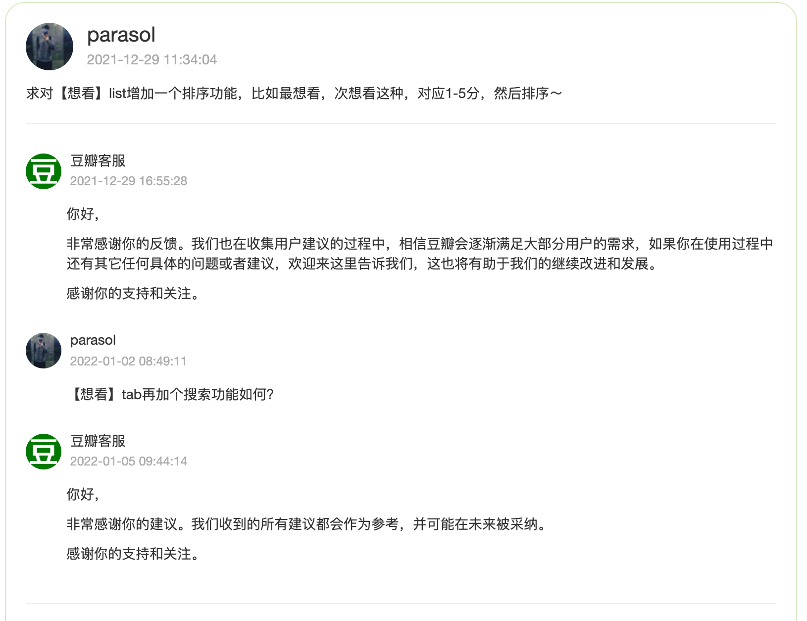
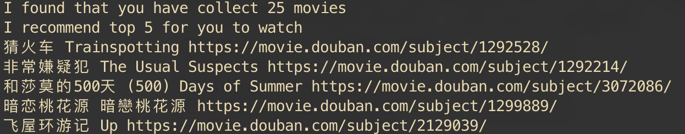

# 手写推荐系统

## V2 基于[协同过滤](https://ieeexplore.ieee.org/document/1167344)的推荐系统
主要是参考亚马逊的经典paper: [paper-link](https://ieeexplore.ieee.org/document/1167344)

### TBD

## V1 基于规则random推荐系统

> date: 2022-01-09  
> code: rec_by_self_v1.py  
> 说人话：丐中丐版的推荐系统

### 背景
目前豆瓣上的「想看」list，只有简单的按照「收藏时间」、「评分」、「标题」排序的功能，给豆瓣提了需求，豆瓣说收到以后也没有后文了；抱着“求人不如求己”的心态，自己手撸个脚本，根据自己的喜好来进行推荐，实现定制化（in other words: 在下自己的代码，爱咋折腾咋折腾）

### 方案
给定「账号id」和「cookies」，将账号id对应的「想看」list里的电影找出来，然后根据需求选择电影进行推荐  
(所以当你剧荒了，还可以用其他人的账号id来给自己推荐，真香哈哈哈٩(●̮̃•)۶)

- 为什么需要自己拷贝cookies：豆瓣有时候会出现验证码登录，如果采用selenium的爬虫方式，cost比较大，所以copy cookies是一个ROI更高的方式。 
- 主要增加了以下几个策略
  - 打分策略：筛选掉小于x分的电影
  - 内容策略：筛选掉非指定内容种类的电影，e.g.: 剧情，动画片，纪录片, so on
  - 时长策略：筛选掉时长大于阈值的电影（现在的电影都太长了， 动不动就两三个小时起步。。。）
  - 国家策略：筛选掉非指定国家的电影

还有很多乱七八糟的策略其实都可以加入：  
- [UCB策略](https://zhuanlan.zhihu.com/p/32356077)
- 打散策略
- 新鲜度策略
- ...

但预期后面通过算法来做，不整这些硬规则了，代码圣经：又不是不能用

### 使用方法
- 将浏览器中豆瓣的cookies copy出来放到本目录下的cookies文件中  
- 执行命令：  
`python run.py --account_id 175455903 --topk 5 --rate 8.0 --duration 120 --country 美国 --content_type 剧情 --send_email True`
  - account_id: 豆瓣上给的id，很早以前的id应该是按照名字来的；后来的id是数字，可以去豆瓣的链接上找找，一般是people/后面的这一串数字
  - topk: 最后推荐的个数
  - rate: 得分阈值，小于该阈值会被过滤掉
  - duration: 时长阈值，大于该阈值会被过滤掉
  - country: 不是这个country的电影会被过滤掉
  - content_type: 不是这个类型的电影会被过滤掉
  - send_email: 是否将推荐结果推送到指定邮箱，邮箱的配置在conf.py下，所见即所得，密码放在本目录的email_password文件里

### 示例结果
（用老板的账号做个测2333）
